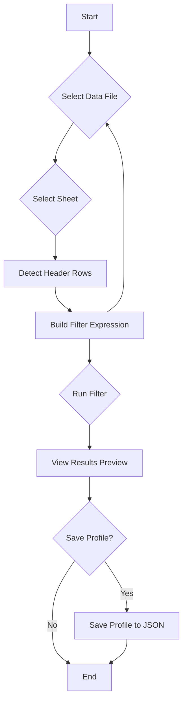

# Application Architecture

## High-Level Workflow (Filter Mode)

This diagram shows the end-to-end user journey for the "SPEC QA Recon" (Filter) mode.



This document provides a high-level overview of the application architecture for the "SPEC QA Recon" feature. The application follows a classic desktop GUI architecture that separates concerns into a few distinct layers, resembling a Model-V
iew-Controller (MVC) pattern.

*   **View (GUI Layer - `com.excelutility.gui`)**: Contains all Swing components (`JFrame`, `JPanel`, etc.) that the user interacts with. This layer is responsible for rendering the UI and capturing user input.
*   **Controller/Service (Core Logic Layer - `com.excelutility.core`)**: Contains the business logic. It orchestrates the main operations like filtering data and acts as the bridge between the UI and the lower-level I/O operations.
*   **Model (Data Objects)**: The `.core` and `.io` packages contain data-holding classes like `FilterProfile`, `FilterRule`, and `GroupNode`, which represent the application's state and data structures.
*   **I/O (Persistence Layer - `com.excelutility.io`)**: Handles all interactions with the file system, including reading/writing Excel files and serializing/deserializing profile objects to JSON.

This separation ensures that the UI is decoupled from the business logic, making the application easier to maintain and test. The diagrams below illustrate the flow of control and data for key user stories.

## Data Flow: Preview Search

This diagram shows the sequence of events when a user initiates a "Preview Search" to test their filter expression.

1.  The user clicks the "Preview Search" button in the `FilterPanel`.
2.  The `FilterPanel` calls `getExpression()` on the `FilterExpressionBuilderPanel` to recursively build a `FilterExpression` object from the current state of the UI controls.
3.  The `FilterPanel` invokes the `FilteringService.filter()` method in a background thread (`SwingWorker`), passing it the file path and the `FilterExpression` object.
4.  The `FilteringService` uses the `ExcelReader` to load the data from the source file.
5.  After processing the data against the expression tree, the `FilteringService` returns a list of matching rows.
6.  Back on the UI thread, the `FilterPanel` receives the list of results and uses a helper method to populate the table in the "Preview" tab of the `JTabbedPane`.

```mermaid
flowchart TD
    subgraph User Interaction
        A[User clicks 'Preview Search' button]
    end

    subgraph UI Layer (com.excelutility.gui)
        B[FilterPanel]
        C[FilterExpressionBuilderPanel]
        D[JTabbedPane 'Unified Data View']
    end

    subgraph Core Logic Layer (com.excelutility.core)
        E[FilteringService]
    end

    subgraph I/O Layer (com.excelutility.io)
        F[ExcelReader]
    end

    A --> B
    B -->|1. Gets filter logic| C
    C -->|2. Returns FilterExpression object| B
    B -->|3. Calls filter() in background| E
    E -->|4. Reads .xlsx file| F
    F -->|5. Returns row data| E
    E -->|6. Returns filtered results| B
    B -->|7. Populates 'Preview' tab| D
```

## Data Flow: Save Profile

This diagram illustrates how a user's filter configuration is persisted to the filesystem as a JSON file.

1.  The user clicks the "Save Profile As..." item from the "File" menu.
2.  The `FilterPanel` displays a `JOptionPane` to get a name for the profile.
3.  Upon receiving a name, the `FilterPanel` gathers the current state (filter expression, selected sheet, etc.) and instantiates a new `FilterProfile` data object.
4.  The `FilterPanel` calls the `FilterProfileService.saveProfile()` method, passing the `FilterProfile` object.
5.  The `FilterProfileService` uses the Jackson `ObjectMapper` to serialize the `FilterProfile` object into a JSON string.
6.  It then determines the correct versioned filename (e.g., `MyProfile-v2.json`) and writes the JSON string to a file in the `profiles/` directory.
7.  Finally, the `FilterPanel` shows a success message to the user.

```mermaid
flowchart TD
    subgraph User Interaction
        A[User clicks 'Save Profile As...' menu item]
    end

    subgraph UI Layer (com.excelutility.gui)
        B[FilterPanel]
        C[JOptionPane for Profile Name]
    end

    subgraph Data Model (com.excelutility.core)
        D[new FilterProfile object]
    end

    subgraph I/O Service Layer (com.excelutility.io)
        E[FilterProfileService]
        F[Jackson ObjectMapper]
    end

    subgraph Filesystem
        G[profiles/MyProfile.json]
    end

    A --> B
    B -->|1. Prompts for name| C
    C -->|2. Returns profile name| B
    B -->|3. Gathers state & creates object| D
    B -->|4. Calls saveProfile()| E
    E -->|5. Serializes object to JSON| F
    F -->|6. Writes JSON string| E
    E -->|7. Saves file to disk| G
    E -->|8. Returns success| B
    B -->|9. Shows success message| C
```
